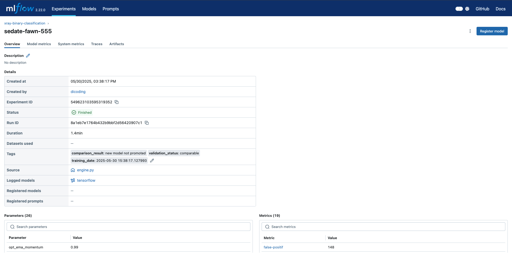
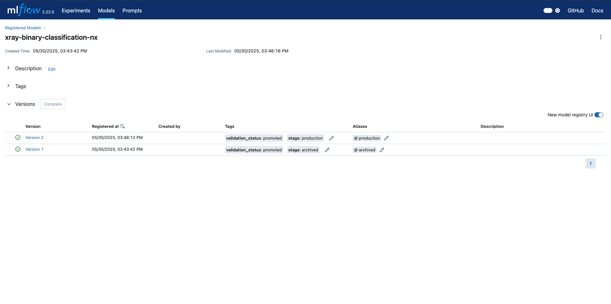

# Introductions
We are going to reproduce 4 types of pipeline:
- Data pipeline
- Training pipeline
- Validation pipeline
- Serving pipeline

The stack that used is **Prefect**.

# Validation Pipeline
The objective of validation pipeline is to validate several component.
- Data Validation
- Training Validation
- Model Validation

## Data Validation
This pipeline is to validate our data that gonna be used for create/update model machine learning.
The validation has three distinct checks on our data:
- Check for data anomalies.
- Check that the data schema hasn’t changed.
- Check that the statistics of our new datasets still align with statistics from our previous training datasets.

# Retraining process for whole pipeline (data, training, and validation)
To retrain pipeline, we can set based on several cases:
- Automate:
    - Based on a schedule or a trigger, the training and validations pipeline will start based on specific time.
    - Model performance degradation
    - On signification change in data distributions (keyword: concept drift).
- Manual:
    - On demand, when the stackholder need to create their own new models.
    - On availability new trainig data.

### Scheduling Pipeline with Prefect
To do scheduling with Prefect, you only need to create deployment on your script. 
In this case, the function main_pipeline() can add .serve to make it as deployment
`main_pipeline.serve(name='xx', interavl=60)` or you can use cron method.
More about .serve: https://docs.prefect.io/v3/deploy/run-flows-in-local-processes#additional-serve-options

# Inisight about the types of pipeline
There are some types of pipeline that can produce for machine learning systems. The pipeline can be categorized with two functions:
- Delivered predictions: Type of pipeline that orchestrate when user request, make predictions, and returning predictions result.
- Create/update models: Type of pipeline that create and updating existing models.

Based on the two functions above, we can define 4 types of pipelinse:
- Data pipeline: Type of pipeline that reproduce data for training models.
- Training Pipeline: Type of pipeline that retraining models.
- Validation Pipeline: Type of pipeline that validate the new models.
- Serving Pipeline: Type of pipeline that running predictions to our models.

# About MLFlow
Currently there is an error when running mlflow project because of conflict when using mlflow.start_run().

But when not specified it, the pipeline not tracked into "pipeline run" even tho it's finished.
It could be a BUG from MLFLOW: 
http://github.com/mlflow/mlflow/issues/4830

# Progress
For now, retraining pipeline is already finished. 
Based on f1-score and prediction accuracy, new model would be stored into mlflow registry with aliases `@production`.

This is the objective of how to retraining pipeline and store it into mlflow registry:
- If there is no model in the registry, the new model is saved.
- If a model already exists, the new model is compared with the registered one.
    - If it performs better, it is saved and promoted.
    - If it is not better, it is not saved.

> Condition in MLFLow experiment

> Condition in MLFlow Registry

# Still need to explore
- Monitoring and Logging
- CI/CD
- Workflow Instrumentations